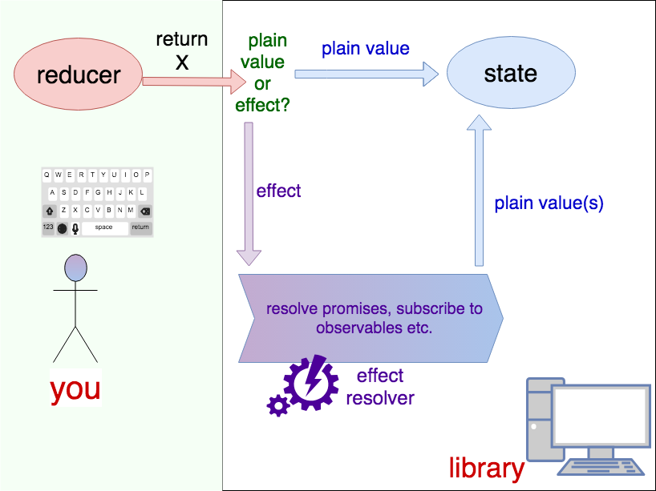

Feedbacks - reactive blueprints for your Redux apps
===

No more wiring manually your actions, reducers, thunks etc. 

Just create a "blueprint" which will define a **shape of state** and define how it should **react on incoming actions** (pattern-matching: action -> reducer). 

You can hook into **individual properties** even deep in the state (and wire up a property to the reducer via **pattern-matching** mechanism)

**Reducers** in Feedbacks can **return both normal values and effects**. And **effects represent future value(s) of property**. 

Observables and promises are **auto-resolved**, and owner property is auto-updated.



Feedbacks:
---
- matches actions automatically (powerful DSL with pattern matching capabilities)
- allows for working on individual properties / slices of state
- resolves promises and observables and feeds it back to given property in the state
- enables to return declarative effects from reducers
    - allows you to handle custom effects in effect handlers (`onEffect`)
    - provides you with some standard effects (like `fx.waitFor` for waiting for specific actions)

Blueprints
====

What are blueprints? Well, if you use Redux you probably are familiar with concept of "initial state" i.e. object which represents how the store state will look in the beginning. Blueprints take this idea further and represent **not only initial state**, but also **all future states** of your application. This means you can match specific actions ([read more about matching actions](docs/api.md#formulas---init-and-on)) into specific properties of the state and associate them with specific reducer.

This effectively would slice your state into individual properties with own property matchers and own reducers. Something similar to nested `combineReducers` but with pattern-matching. 

example of blueprint: 

```javascript
const blueprint = {
    foo: {
        bar: init(10) // initial state of property foo.bar
            .on({type: 'increment'} /*pattern matching */ , (state, action) => {
                return state + 1;
            })
            .on({type: 'decrement'}, (state, action) => {
                return state - 1;
            })
    },
}
```

Reducers
===

In previous example reducers returned just a plain value but they may return various effects as well:

```javascript
const promiseReducer = (state, action) => () => Promise.resolve('future value');

const rxCounter = (state, action) => Rx.interval(1000);

const generatorCounter = (state, action) => function *() {
    let counter = 0;
    while (true) { 
        yield fx.delay(1000); 
        yield fx.next(counter++)
    }
}
```

Reducers stay pure because they return only description of "what should happen" and not really change anything. 

# API 

Click this link to read more detailed [Feedbacks API guide](docs/api.md).

# Online examples

* Live example on Codesandbox: https://codesandbox.io/s/6zzrnwq63w

* Calendar example
    * on Github: https://github.com/hex13/feedbacks/tree/master/examples/calendar
        * Especially this file which contains all store logic: https://github.com/hex13/feedbacks/blob/master/examples/calendar/src/store.js
    * online demo version: http://hex13.github.io/apps/feedbacks


If you have a problem feel free to create an issue: https://github.com/hex13/feedbacks/issues 
 
# Power of declarativeness

## Traditional Redux:

You first think about actions, when to dispatch them (e.g. in thunks), how reducer should change state upon this action:

"I will spawn some side-effects (e.g. API call) then I will dispatch `FOO` action. I will write reducer which will react to `FOO` action by changing property `foo` in store.

So basically **half of your code is imperative/procedural**, only second half (in reducers) is declarative/functional. This raises some problems (for example boilerplate in your imperative thunks, or proliferation of helper actions which will act only as [DTO](https://en.wikipedia.org/wiki/Data_transfer_object) between imperative side of your app (e.g. thunks) and declarative reducers).

## Feedbacks:

You first think about shape of your state how the state will change because of actions:

"I have `foo` property in my store and I can describe on which actions `foo` will react and how its value will be changing"

Changes can be **immediate**, e.g.
```javascript
(value, action) => value + action.amount
(value, action) => 42
```
or **deferred** e.g.
```javascript
(value, action) => () => Promise.resolve(42)
(value, action) => Rx.interval(1000)
(value, action) => () => somePromiseBasedAPI()
```

This allows you for conciseness (especially that Feedbacks comes with the nice DSL).

# Pattern Matching

Feedbacks allow you also for making some advanced pattern matching. You've seen string based patterns in examples above. But this is not the end. Look something like this:

```javascript
// ...
{
    foo: init(0)
        .on({
            type: 'response',
            payload: {
                status: value => value >= 400 && value < 500
            }
        }, (value, action) => action.payload.content)
}
// ...
```

# Philosophy of side-effects

Feedbacks address the fact so called "side-effects" are often merely a way to get some data and put it back in some property of the Redux state. Consider this code, written traditionally:


```javascript 
const fetchTodos = () => {
    return dispatch => {
        someAsyncApi().then(data => {
            dispatch({type: 'TODOS_FETCHED', todos: data})
        })
    }
};

const reducer = (state, action) => {
    switch (action.type) {
        case 'TODOS_FETCHED':
            return {
                ...state,
                todos: action.todos
            }
    }
}
```

There is a problem with that.

There is a ton of indirection and logic is put all over the project (in the example above we have half of logic in thunk - when we fetch data, the other half in reducer when we apply data to the given property in the state).

In Feedbacks library you are encouraged to write more direct code. Let's rewrite previous example to Feedbacks: 
```javascript
{
    todos: on('FETCH_TODOS', (state, action) => () => someAsyncApi())
}
```

this way in one line of code you express:
1. what should be target property of state change (`todos`)
2. which action you want to handle (`FETCH_TODOS` but you're not limited to just matching by type. Read more about [advanced pattern matching](#pattern-matching))
3. how value will change including asynchronous changes via observables or function-wrapped promises. You could also spawn another action (and reducer of the next action could send values back to previous property by using `yield` statement). TODO: example

# Dev tools

Same as Redux Dev Tools but use [@hex13/redux-devtools-log-monitor](https://www.npmjs.com/package/@hex13/redux-devtools-log-monitor) instead of default LogMonitor.
Installation process: https://github.com/reduxjs/redux-devtools/blob/master/docs/Walkthrough.md

# Tips & Tricks

## Changing more than one property during action:

You can do it in either way:

1. match on all properties you want to change:

```javascript
{
    user: {
        name: init('')
            .on('changeUser', (value, action) => action.payload.name),
        city: init('')
            .on('changeUser', (value, action) => action.payload.city),
    },
}
```
2. match action at the upper property:

```javascript
{
    user: init({name: '', city: ''})
        .on('changeUser', (value, action) => action.payload)
}
```

Whatever will make more sense to what you want to achieve.


# Integration with other libraries

## React

You can use [react-redux](https://github.com/reduxjs/react-redux) (Official React bindings for Redux)

## Rx.js

No need for special preparations. Just import [Rx.js](https://github.com/Reactive-Extensions/RxJS) as usual and at this point you can use it with Feedbacks. For example you can return Observables from reducers.


# But Feedbacks is not even correct word...

Maybe. But who cares? 

And this is Doge: https://en.wikipedia.org/wiki/Doge_(meme)


# Additional reading

Redux documentation: https://redux.js.org/

